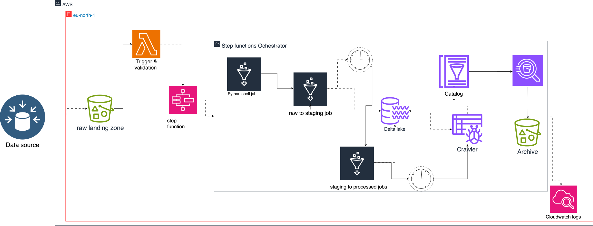

# Lab 5 ETL Pipeline

## Overview
This project implements an ETL (Extract, Transform, Load) pipeline using AWS Glue, AWS Step Functions, and Delta Lake for processing e-commerce data (orders, order items, and products). The pipeline handles raw data ingestion, transformation, validation, and storage in a data lakehouse architecture, with robust error handling and testing.

## Architecture
The pipeline follows a layered data lakehouse architecture:
- **Raw Landing Zone**: Stores input files (`orders_apr_2025.xlsx`, `order_items_apr_2025.xlsx`, `products.csv`) in S3 (`s3://lakehouse-lab5/raw_landing_zone/`).
- **Staging Layer**: Validates and transforms raw data into Delta Lake tables (`s3://lakehouse-lab5/lakehouse-dwh/staging/`).
- **Processed Layer**: Applies deduplication, timestamp conversion, and partitioning, storing results in Delta Lake tables (`s3://lakehouse-lab5/lakehouse-dwh/processed/`).
- **Athena Query Output**: Stores query results (`s3://lakehouse-lab5/athena_query_results/`).
- **Archive**: Moves processed files to `s3://lakehouse-lab5/lakehouse-dwh/archived/stepfunction/`.



## Components
### AWS Step Function (`lab5-stepfunction.json`)
- Orchestrates the ETL workflow with states for:
  - Input normalization
  - Header validation via Lambda (`lab5-validate-trigger`)
  - File type routing (orders, order items, products)
  - Glue job execution for raw and staging layers
  - Athena query execution
  - File archiving
  - Error handling with SNS notifications (`arn:aws:sns:eu-north-1:763927202642:lab5-alerts`)

### Glue Jobs
- **Raw Layer Jobs**:
  - `raw_orders_job.py`: Processes `orders_apr_2025.xlsx`, validates file existence, and writes to Delta Lake staging.
  - `raw_orderitems_job.py`: Processes `order_items_apr_2025.xlsx`, similar to orders.
  - `raw_products_job.py`: Processes `products.csv`, reads CSV, and writes to Delta Lake staging.
- **Staging Layer Jobs**:
  - `staging_order_job.py`: Validates, deduplicates, and partitions orders data, merging into processed Delta tables.
  - `staging_orderitems_job.py`: Similar processing for order items, with composite key deduplication.
  - `staging_products_job.py`: Validates and deduplicates products, merging into processed Delta tables.

### Tests
- **Raw Layer Tests** (`test_raw_jobs.py`):
  - Validates job structure, S3 connections, data validation, and column mapping.
- **Staging Layer Tests** (`test_staging_jobs.py`):
  - Tests job structure, data quality, transformations, aggregations, deduplication, error handling, S3 output, partitioning, and schema evolution.
- Uses pytest, Spark, and boto3 mocks for comprehensive testing.

## Setup
1. **Prerequisites**:
   - AWS account with permissions for S3, Glue, Step Functions, Lambda, SNS, and Athena.
   - Python 3.8+ and required libraries (`pytest`, `pyspark`, `boto3`, `pandas`, `delta`).
   - Spark and AWS Glue environment configured.

2. **S3 Setup**:
   - Create bucket `lakehouse-lab5`.
   - Ensure paths: `raw_landing_zone/`, `lakehouse-dwh/staging/`, `lakehouse-dwh/processed/`, `athena_query_results/`, `lakehouse-dwh/archived/stepfunction/`.

3. **Deploy Glue Jobs**:
   - Upload `raw_*.py` and `staging_*.py` scripts to Glue.
   - Configure job names: `lab5-raw(orders)`, `lab5-raw(order_items)`, `lab5-raw(products)`, `lab5-Staging-orders`, `lab5-Staging-order_items`, `lab5-staging_products`.

4. **Deploy Step Function**:
   - Deploy `lab5-stepfunction.json` with updated ARNs for your account.
   - Configure Lambda function `lab5-validate-trigger` for header validation.
   - Set up SNS topic `lab5-alerts`.

5. **Run Tests**:
   ```bash
   pytest tests/
   ```

## Usage
1. Upload input files to `s3://lakehouse-lab5/raw_landing_zone/`.
2. Trigger the Step Function manually or via S3 event notifications.
3. Monitor execution via CloudWatch logs and SNS alerts.
4. Query processed data using Athena (`lakehouse_dwh` database).

## Data Schema
- **Orders**:
  - `order_id` (Integer, not null)
  - `user_id` (Integer, not null)
  - `order_timestamp` (Timestamp, not null)
  - `order_num` (Integer, nullable)
  - `total_amount` (Double, nullable)
  - `date` (Date, not null)
- **Order Items**:
  - `id` (Integer, not null)
  - `order_id` (Integer, not null)
  - `user_id` (Integer, not null)
  - `days_since_prior_order` (Integer, nullable)
  - `product_id` (Integer, not null)
  - `add_to_cart_order` (Integer, nullable)
  - `reordered` (Integer, nullable)
  - `order_timestamp` (Timestamp, not null)
  - `date` (Date, not null)
- **Products**:
  - `product_id` (Integer, not null)
  - `product_name` (String, not null)
  - `department_id` (Integer, nullable)
  - `department` (String, nullable)

## Error Handling
- File validation failures trigger SNS notifications.
- Glue job errors are caught and logged, with SNS alerts.
- Missing or empty files are handled gracefully.
- Schema evolution is supported via flexible column handling.

## Testing
- Comprehensive unit tests cover:
  - Job importability
  - Data quality (null checks, format validation)
  - Transformations (type casting, deduplication)
  - S3 operations (mocked)
  - Partitioning and schema evolution
- Run tests with `pytest -v tests/`.

## Limitations
- Assumes specific input file formats (Excel for orders/order items, CSV for products).
- Limited to predefined schemas; new columns require schema updates.
- No real-time processing; designed for batch ETL.

